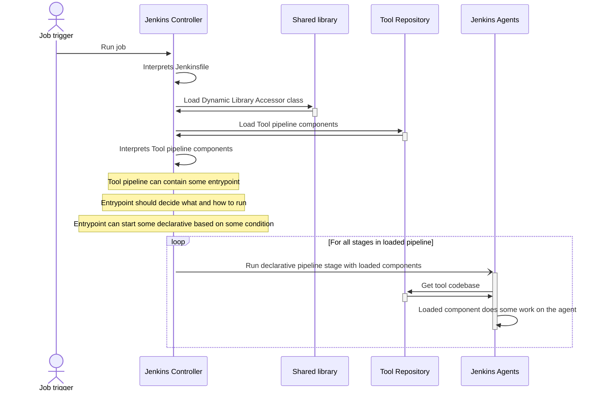

# Jenkins Extendable Pipeline

The repository demonstrates the approach to building extendable Jenkins pipelines with dynamically loaded components.

## Use case

Let's suppose in our team we have some [tool that requires quite complex CI/CD pipeline]().
The tool is developed in the monorepository.

The team uses the declarative approach because this one suits their scenario better. That setup makes the whole pipeline declaration big and complex and at some point of complexity team faces one or more of the issues:

* Size of the Jenkinsfile. The root cause is the limit of the JVM method bytecode but happens a lot in Jenkins (see [this](https://stackoverflow.com/questions/67303181/jenkinsfile-java-lang-runtimeexception-method-code-too-large), [this](https://docs.cloudbees.com/docs/cloudbees-ci-kb/latest/troubleshooting-guides/method-code-too-large-error), [this](https://stackoverflow.com/questions/24256316/method-code-too-large-in-groovy-grails), and [this](https://stackoverflow.com/questions/73609769/jenkins-method-too-large)).
* Development of the pipeline becomes chaotic, as parts of the pipeline are hard to track.
* If the team goes into a [separate shared library](https://www.jenkins.io/doc/book/pipeline/shared-libraries/) many pipelines become dependent on central dependency and this dependency does not reflect specific cases of the particular tool or aspects of the tool are spread across different repositories.
* The team can support git submodules, but Jenkins' support of it sometimes is tricky.
* Permissions issues with separate shared libraries.

So the team decided to split the repeating bits into separate reusable components specific to the tool they are developing.

## Problem statement

For that use case team can go with different solutions, here are some of them:

1. Load component dynamically with ```load``` [step](https://www.jenkins.io/doc/pipeline/steps/workflow-cps/). In that case, components can't use a lot of benefits of Groovy, for instance, imports, so every part should be in its own script and have no relation to others at all.
2. Maintain a separate library for pipeline components and probably leverage usage of the git submodules or just keep it in different repositories by conventions. Cons of that approach described in the use case.
3. Create a library with a pipeline in the same repository as part of the tool's monorepository and try to load it on the fly.

In case of the third option we will face the limitation of the library loader mechanism, that requires some SCM under the hood. And also for each of the repostiry you have to create a library definition in the Jenkins instance.

See some additional discussions on that topic: [SO answer](https://stackoverflow.com/a/67784728/4715872), [Libraries versioning](https://rare-spawn.net/en/posts/an-edge-case-for-jenkins-shared-libraries), and [feature request](https://issues.jenkins.io/browse/JENKINS-46721) that is not addressed for now.

## Load library: on-the-fly-solution

Here we create a small shared library for Jenkins that could be used in many Jenkins setups. It provides a class that loads a components library from a subfolder from the same repository which is going to be processed.

## High-level algorithm

With that approach the high-level algorithm of some pipeline could be like that:

1. Jenkins job run interprets Jenkinsfile.
2. Jenkins job loads this global shared library containing our Dynamic Library Accessor class.
3. Dynamic Library Accessor loads Jenkins Shared library dinamically [from tool repository]().
4. Jenkins job starts one of the declarative pipelines with theirs components from the library loaded on the previous step using entry point function from the library.


